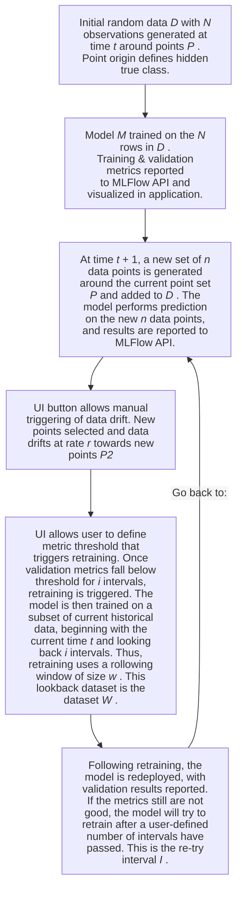
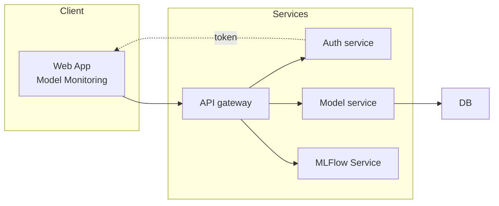

# Overview

This is a demonstration of an MLOps framework for live-monitoring a deployed model's performance. 

The demonstration simulates a real-world process that generates data randomized around a set of points.

In this case, the set of points define latent classes that the model must learn.

Data drift is simulated by a smooth ramping to a new set of randomized points.

# Workflow Diagrams

The verbose description of the workflow can be understood as follows:



### Visualization of the True Class

Also included in the UI application is a visualization of the M-dimensional dataset _W_. A simple deterministic dimensionality reduction is applied to visualize the M-dimensional data. As each new set of points _n_ is generated, the oldest data points in _D_ get dropped off. The set of points defining the true hidden classes are shown and annotated. The scatter plot shows points belonging to the _W_ dataset that would be used for retraining (if triggered), as well as a set of data older than the oldest data point in _W_. Therefore, only the _W_ dataset and a set of _w_ older data observations  needs to be maintained, to manage memory usage and space.

# Architecture

The basic architecture:


# Implementation

Each box in the architecture diagram is a separate service with its own directory,
Dockerfile, tests and README:

| Diagram box | Service | Stack | Docs |
|---|---|---|---|
| Web App | `frontend/` | Next.js 16 · React 19 · Tailwind · Recharts | [README](frontend/README.md) |
| API gateway | `services/gateway/` | Caddy 2 (TLS, routing, forward-auth) | [README](services/gateway/README.md) |
| Auth service | `services/auth/` | FastAPI · JWT (HttpOnly cookie) | [README](services/auth/README.md) |
| Model service | `services/model/` | FastAPI · PyTorch · SQLAlchemy | [README](services/model/README.md) |
| MLFlow Service | `services/mlflow/` | MLflow 3 tracking server + model registry | [README](services/mlflow/README.md) |
| DB | `services/postgres/` | Postgres 17 (`model` and `mlflow` databases) | [README](services/postgres/README.md) |

The dashboard is public. Triggering drift, retraining, changing the policy and opening the
MLflow UI require an operator sign-in. See [docs/architecture.md](docs/architecture.md) for
request flows, the monitoring loop and a table mapping the symbols above
(_N_, _n_, _r_, _i_, _w_, _I_) to settings.

```
.
├── docker-compose.yml        # the whole stack; only the gateway publishes ports
├── .env.example              # every deploy-time setting
├── frontend/                 # Next.js dashboard
├── services/
│   ├── gateway/              # Caddyfile
│   ├── auth/                 # FastAPI auth service
│   ├── model/                # FastAPI + PyTorch model service
│   ├── mlflow/               # MLflow server image
│   └── postgres/             # DB init scripts
├── deploy/droplet/           # provision.sh, deploy.sh, backup.sh
└── docs/                     # architecture, deployment, development
```

## Quick start (local)

```bash
cp .env.example .env
docker compose up --build
```

Open http://localhost, sign in with the credentials from `.env`, and press **Trigger drift**.
Accuracy drops as the class centres move. After _i_ intervals below the threshold, the model
retrains on the window _W_, a new version is registered in MLflow, and accuracy recovers.

## Deploy to DigitalOcean

```bash
ssh root@<droplet-ip>
git clone <repo-url> /opt/mlops-demo
bash /opt/mlops-demo/deploy/droplet/provision.sh   # Docker, swap, firewall, generated secrets
nano /opt/mlops-demo/.env                           # set your domain
bash /opt/mlops-demo/deploy/droplet/deploy.sh
```

The full guide covers sizing, DNS without a domain, backups and troubleshooting:
[docs/deployment.md](docs/deployment.md). For per-service workflows, see
[docs/development.md](docs/development.md).

## To be Added:

* Highlighted / colored windows in the linechart showing which intervals were used for training and which were used for validation. Highlights do not conflict with the data drift window in the line chart.

* In the training params, include the train:test split ratio as a parameter. Also allow selection of using a randomized split or using the recent intervals for validation.

* Add a toggle for a continuous random drift to the data points, using the data drift rate parameter provided in the controls.

* Add another widget to view train vs. validation loss for a given model version (user can select to view one model version's train/valid loss charts, starting from the recent and selecting back however many is kept by the app)

* Finally, add the ability to click and drag data centers, so that the admin user can create custom drift, or create a custom state of point positions.
