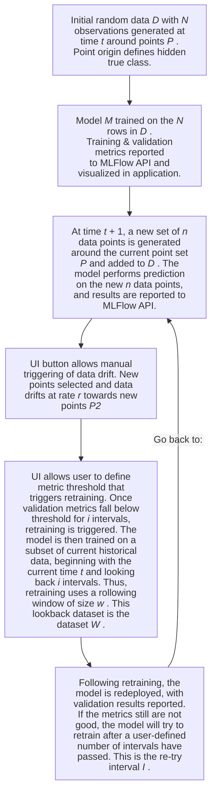
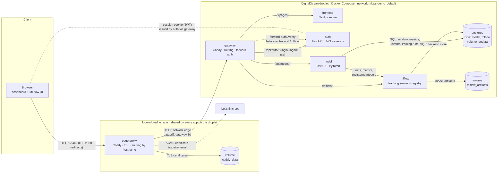

# Overview

This is a demonstration of an MLOps framework for live-monitoring a deployed model's performance. 

The demonstration simulates a real-world process that generates data randomized around a set of points.

In this case, the set of points define latent classes that the model must learn.

Data drift is simulated by a smooth ramping to a new set of randomized points.

# Workflow Diagrams

The verbose description of the workflow can be understood as follows:



### Visualization of the True Class

Also included in the UI application is a visualization of the M-dimensional dataset _W_. A simple deterministic dimensionality reduction is applied to visualize the M-dimensional data. As each new set of points _n_ is generated, the oldest data points in _D_ get dropped off. The set of points defining the true hidden classes are shown and annotated. The scatter plot shows points belonging to the _W_ dataset that would be used for retraining (if triggered), as well as a set of data older than the oldest data point in _W_. Therefore, only the _W_ dataset and a set of _w_ older data observations  needs to be maintained, to manage memory usage and space.

# Architecture



**Architecture type: containerized microservices behind an API gateway.** The system is split
into single-purpose services that talk only over HTTP (and SQL to the database). None
imports another's code, and each has its own directory, dependencies, image, tests and
README. The **gateway** is the single entry point, using the *API gateway* pattern: it routes
by path and enforces authentication centrally with *forward-auth*, asking the auth service to
verify the session before any write and before MLflow. The backend services therefore
contain no auth code, and they aren't reachable from outside. In front of it, the shared
**edge proxy** ([`kloworld-edge`](https://github.com/ko222uky/kloworld-edge), a separate repo)
terminates HTTPS for every app on the droplet and hands this app's hostname to the gateway.

- **The browser only ever talks to the gateway.** The Next.js server renders the dashboard,
  and the dashboard then calls `/api/...` on the same origin. The frontend server never
  calls the backend itself.
- **State lives in two places:** Postgres (the `model` and `mlflow` databases) and the
  `mlflow_artifacts` volume.
- **The model service holds one live, in-memory simulation.** It runs as a single
  process, deliberately not replicated.
- **The other services are stateless** and could be scaled out behind the gateway.

**Containerization.** `docker-compose.yml` defines six containers on one private bridge
network (`mlops-demo_default`), where services find each other by name (for example
`http://mlflow:5000`):

| Container | Image | Built from |
|---|---|---|
| `gateway` | `caddy:2.11-alpine` (official) | configured by `services/gateway/Caddyfile`, mounted read-only |
| `frontend` | built | `frontend/Dockerfile`: 3-stage `node:24-alpine` build, Next.js `standalone` output |
| `auth` | built | `services/auth/Dockerfile`: `python:3.13-slim` + `uv`, locked dependencies |
| `model` | built | `services/model/Dockerfile`: `python:3.13-slim` + `uv`, CPU-only PyTorch |
| `mlflow` | built | `services/mlflow/Dockerfile`: `python:3.13-slim`, pinned `mlflow==3.16.1` |
| `postgres` | `postgres:17-alpine` (official) | init script creates the `mlflow` database |

- **Only the gateway publishes a port**, and only on `127.0.0.1`. Everything else, Postgres
  included, is reachable only on the internal network. On the droplet,
  [`compose.edge.yml`](compose.edge.yml) also attaches the gateway to the shared `edge`
  network, where the edge proxy reaches it.
- **Every custom image runs as a non-root user.**
- **Health checks:** each service has a `HEALTHCHECK`, and Compose starts services in
  dependency order with `depends_on: condition: service_healthy`
  (postgres → mlflow → model → gateway). Every container uses `restart: unless-stopped`.
- **Configuration and secrets** come from a `.env` file (mode 600 on the server) through
  Compose variable substitution. Nothing secret is baked into an image.
- **Persistent data** lives in named volumes that survive rebuilds and redeploys:
  `pgdata`, `mlflow_artifacts`, and the gateway's `caddy_data` and `caddy_config`.
- **The same Compose file runs locally** (`http://localhost`) and on the droplet (behind the
  edge proxy's HTTPS). The droplet is updated by GitHub Actions after CI passes on `main`; see
  [docs/deployment.md](docs/deployment.md).

# Implementation

Each service in the architecture diagram has its own directory, image, tests (where it has
code) and README:

| Compose service | Directory | Stack | Docs |
|---|---|---|---|
| `frontend` | `frontend/` | Next.js 16 · React 19 · Tailwind · Recharts | [README](frontend/README.md) |
| `gateway` | `services/gateway/` | Caddy 2 (TLS, routing, forward-auth) | [README](services/gateway/README.md) |
| `auth` | `services/auth/` | FastAPI · JWT (HttpOnly cookie) | [README](services/auth/README.md) |
| `model` | `services/model/` | FastAPI · PyTorch · SQLAlchemy | [README](services/model/README.md) |
| `mlflow` | `services/mlflow/` | MLflow 3 tracking server + model registry | [README](services/mlflow/README.md) |
| `postgres` | `services/postgres/` | Postgres 17 (`model` and `mlflow` databases) | [README](services/postgres/README.md) |

The dashboard is public. Triggering drift, retraining, changing the policy and opening the
MLflow UI require an operator sign-in. See [docs/architecture.md](docs/architecture.md) for
request flows, the monitoring loop and a table mapping the symbols above
(_N_, _n_, _r_, _i_, _w_, _I_) to settings.

```
.
├── docker-compose.yml        # the whole stack; only the gateway publishes a port
├── compose.edge.yml          # droplet only: joins the gateway to the edge proxy's network
├── .env.example              # every deploy-time setting
├── frontend/                 # Next.js dashboard
├── services/
│   ├── gateway/              # Caddyfile
│   ├── auth/                 # FastAPI auth service
│   ├── model/                # FastAPI + PyTorch model service
│   ├── mlflow/               # MLflow server image
│   └── postgres/             # DB init scripts
├── deploy/droplet/           # provision.sh, deploy.sh, backup.sh
└── docs/                     # architecture, deployment, development
```

## Quick start (local)

```bash
cp .env.example .env
docker compose up --build
```

Open http://localhost, sign in with the credentials from `.env`, and press **Trigger drift**.
Accuracy drops as the class centres move. After _i_ intervals below the threshold, the model
retrains on the window _W_, a new version is registered in MLflow, and accuracy recovers.

## Deploy to DigitalOcean

The droplet is shared: [`kloworld-edge`](https://github.com/ko222uky/kloworld-edge) sets up
the host (Docker, swap, firewall) and runs the HTTPS proxy in front of every app. With that
in place:

```bash
ssh root@<droplet-ip>
git clone <repo-url> /opt/mlops-demo
bash /opt/mlops-demo/deploy/droplet/provision.sh   # generated secrets + droplet settings
nano /opt/mlops-demo/.env                           # set your hostname
bash /opt/mlops-demo/deploy/droplet/deploy.sh
# then add caddy/sites/datadrift.caddy to kloworld-edge and deploy it
```

The full guide covers sizing, DNS, backups and troubleshooting:
[docs/deployment.md](docs/deployment.md). For per-service workflows, see
[docs/development.md](docs/development.md).

**New to the codebase?** Start with [docs/onboarding.md](docs/onboarding.md): a reading
order, a guided tour of the source, and recipes for common changes.

## Feature backlog

Delivered on the `feat/drift` branch; details are in the service and frontend READMEs.

- [x] Highlighted / colored windows in the linechart showing which intervals were used for training and which were used for validation. Highlights do not conflict with the data drift window in the line chart.
  Where: Accuracy chart: a bottom lane shows, for each interval, how many of its rows the selected model version used for training and for validation (random splits included), clear of the drift shading.

- [x] In the training params, include the train:test split ratio as a parameter. Also allow selection of using a randomized split or using the recent intervals for validation.
  Where: Training parameters: **Validation split** (recent intervals or random rows) and **Validation share**, shown as a train : validation ratio.

- [x] Add a toggle for a continuous random drift to the data points, using the data drift rate parameter provided in the controls.
  Where: Controls: **Continuous drift** switch; each drift leg chains into a new one at the drift rate.

- [x] Add another widget to view train vs. validation loss for a given model version (user can select to view one model version's train/valid loss charts, starting from the recent and selecting back however many is kept by the app)
  Where: **Model version** panel: training vs. validation loss per epoch for any version kept this session.

- [x] Finally, add the ability to click and drag data centers, so that the admin user can create custom drift, or create a custom state of point positions.
  Where: Projection: signed-in operators drag a centre P, choosing **Drag: move now** or **Drag: drift there**.
