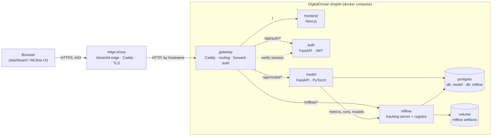
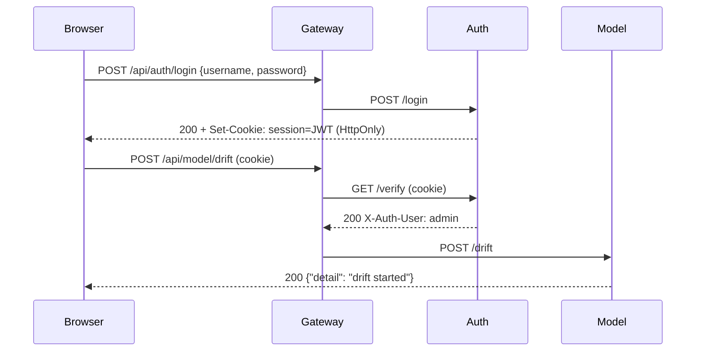
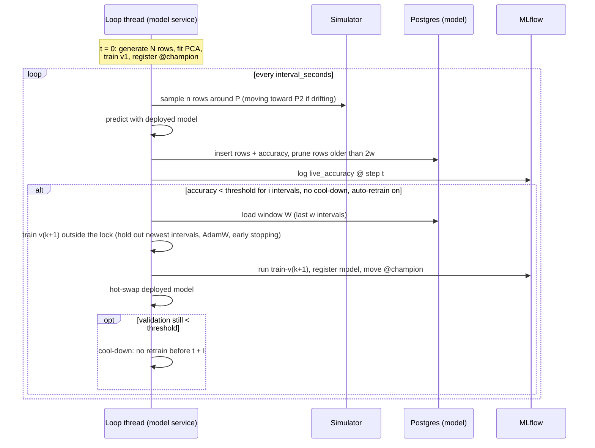

# Architecture

## Services

| Service | Directory | Tech | Owns | Talks to |
|---|---|---|---|---|
| gateway | [`services/gateway`](../services/gateway) | Caddy 2 | Routing, access policy | everything (HTTP) |
| frontend | [`frontend`](../frontend) | Next.js 16, React 19, Recharts | The dashboard UI | gateway only (same-origin) |
| auth | [`services/auth`](../services/auth) | FastAPI, PyJWT | Operator sessions | nobody |
| model | [`services/model`](../services/model) | FastAPI, PyTorch, SQLAlchemy | Simulation, classifier, monitoring, retraining | postgres, mlflow |
| mlflow | [`services/mlflow`](../services/mlflow) | MLflow 3 | Experiment history, model registry, artifacts | postgres, artifact volume |
| postgres | [`services/postgres`](../services/postgres) | Postgres 17 | Durable state for model and mlflow | — |

Boundaries are strict. Each service has its own directory, dependency manifest, Dockerfile,
tests and README. No service imports another's code, and they communicate only over HTTP
or SQL. Only the gateway publishes a port (on `127.0.0.1`). HTTPS is terminated outside
this repo by the shared edge proxy ([`kloworld-edge`](https://github.com/ko222uky/kloworld-edge)),
which serves every app on the droplet and forwards this app's hostname to the gateway.

## Access policy

| Who | Can |
|---|---|
| Anyone | View the dashboard (all `GET /api/model/*`) |
| Signed-in operator | Trigger drift, retrain, pause/resume, pause automatic retraining, reset, edit the policy and training parameters; open MLflow |

The policy lives in one place, the `Caddyfile`. Backend services contain no auth code of
their own; they trust the gateway, which is the only way to reach them.

## The monitoring loop

This is the workflow from the README, as the model service implements it:

### Symbol reference

| README symbol | Meaning | Where to set it |
|---|---|---|
| M | feature dimensions | `MODEL_N_FEATURES` |
| P / P2 | current / drift-target class centres | shown on the projection chart |
| N | initial dataset size | `MODEL_INITIAL_SIZE` |
| n | observations per interval | dashboard policy · `batch_size` |
| r | drift rate (fraction of the path per interval) | dashboard policy · `drift_rate` |
| i | consecutive below-threshold intervals before retraining | dashboard policy · `breach_intervals` |
| w | window W length in intervals | dashboard policy · `window_intervals` |
| I | retry interval after a retrain that did not recover | dashboard policy · `retry_intervals` |

## Data retention

- **Observations:** only the last `2w` intervals are kept, which covers the window W plus `w`
  older intervals for the "older data" layer in the plot. Storage stays bounded however long
  the demo runs.
- **Metrics and events:** kept for the session. A restart or reset begins a new session.
- **MLflow:** everything is kept across sessions; runs are tagged with `session`.

## Deliberate simplifications

These keep the demo small. Each can be upgraded without touching the other services.

| Simplification | Upgrade path |
|---|---|
| Single operator account from env vars | User table with hashed passwords inside the auth service |
| Ground-truth labels arrive with each batch | Delayed labels: the loop would evaluate an older batch each interval |
| Simulation restarts with the process | Persist simulator state (centres, RNG) in the `model` DB |
| One host, docker compose | The same images run on DOKS/Kubernetes; the Caddyfile becomes an Ingress |
