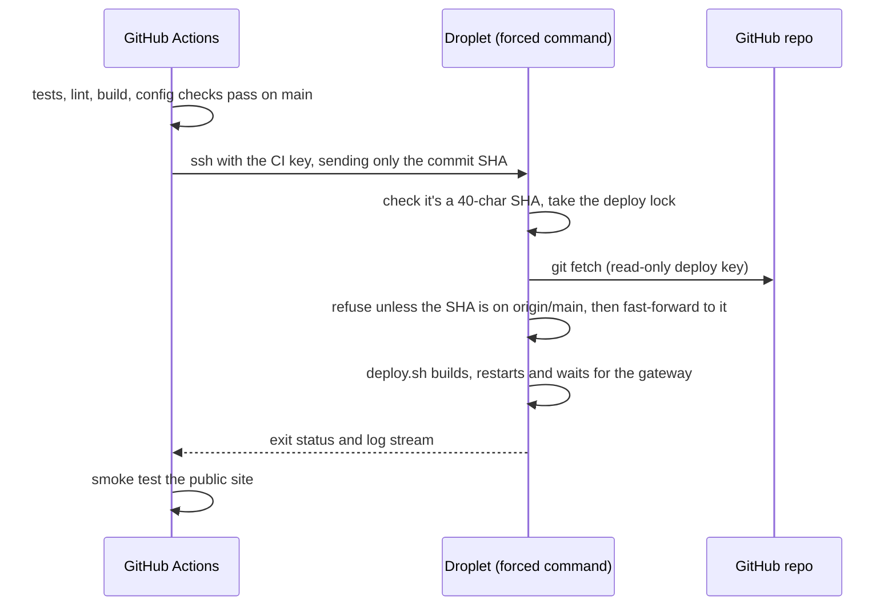

# Deploying to a DigitalOcean droplet

The whole system runs on one droplet with docker compose. Caddy obtains HTTPS certificates
automatically.

## 1. Create the droplet

| Setting | Recommendation |
|---|---|
| Image | Ubuntu 24.04 LTS x64 |
| Size | **Basic, 2 vCPU / 4 GB** (about $24/mo) recommended. 2 GB works for running the stack, but builds rely on the swap file that `provision.sh` adds |
| Auth | SSH key |
| Extras | Enable monitoring; optionally add a Cloud Firewall allowing 22, 80, 443 (TCP + UDP 443) |

## 2. Point a hostname at it

HTTPS needs a hostname:

- **Your own domain:** use a subdomain such as `datadrift.example.com` and create an `A` record
  for it at whichever provider hosts the domain's DNS:

  | Type | Name | Value | TTL |
  |---|---|---|---|
  | `A` | `datadrift` | droplet IPv4 (or its Reserved IP) | 300 |

  - **Cloudflare:** set the record's proxy status to **DNS only** (grey cloud). If it's
    proxied, visitors reach Cloudflare instead of the droplet, and Caddy's Let's Encrypt
    certificate can fail. `nslookup` should return the droplet's IP, not a Cloudflare
    `104.x` or `172.64–71.x` address.
  - **Optional Reserved IP** (DigitalOcean → Networking → Reserved IPs): free while
    attached. Point DNS at it, and a rebuilt droplet can take over the same address.
  - Only the subdomain needs a record; the bare domain can stay empty.
  - Don't add an `AAAA` (IPv6) record until HTTPS works over IPv4. Let's Encrypt prefers
    IPv6, and a broken IPv6 path blocks certificate issuance.
- **No domain:** use `sslip.io`, which resolves `<ip-with-dashes>.sslip.io` to that IP. For
  example, `203-0-113-10.sslip.io` works with no DNS setup at all.

The name must resolve **before** the first deploy.

## 3. Provision and fetch the code

Run these from your own machine. Stream `provision.sh` to the droplet over SSH; the
droplet doesn't need the code for this step:

```bash
ssh root@<droplet-ip> 'bash -s' < deploy/droplet/provision.sh
```

`provision.sh` does the following:

- Installs Docker Engine and the compose plugin.
- Adds 4 GB of swap.
- Sets up the firewall to allow SSH, 80 and 443 only (IPv4 and IPv6).
- Turns on unattended security upgrades.

It's safe to re-run.

### Private repository: give the droplet a read-only deploy key

A private repo can't be cloned anonymously. A **deploy key** is an SSH key that GitHub
accepts for **one repository, read-only**, so the droplet can clone and later `git pull`
without your personal credentials. The key pair is created **on the droplet**: the private
key never leaves it, and only the public half goes to GitHub.

1. **On the droplet,** create the key and pin GitHub's host key. The fingerprint check
   guards against connecting to an impostor server; compare it with the fingerprint in
   [GitHub's published SSH key fingerprints](https://docs.github.com/en/authentication/keeping-your-account-and-data-secure/githubs-ssh-key-fingerprints):

   ```bash
   ssh root@<droplet-ip>
   ssh-keygen -t ed25519 -N "" -C "deploy@<your-hostname>" -f ~/.ssh/github_deploy
   ssh-keyscan -t ed25519 github.com > /tmp/gh_key
   ssh-keygen -lf /tmp/gh_key   # must print SHA256:+DiY3wvvV6TuJJhbpZisF/zLDA0zPMSvHdkr4UvCOqU
   cat /tmp/gh_key >> ~/.ssh/known_hosts
   printf 'Host github.com
  User git
  IdentityFile ~/.ssh/github_deploy
  IdentitiesOnly yes
' >> ~/.ssh/config
   chmod 600 ~/.ssh/config
   cat ~/.ssh/github_deploy.pub   # the public key: copy this single line
   ```

2. **On GitHub,** open the repo → **Settings → Deploy keys → Add deploy key**. Paste the
   public key as one line, and leave **Allow write access unticked**.
3. **Check** that GitHub accepts it, then clone:

   ```bash
   ssh -T git@github.com   # "Hi <owner>/<repo>! You've successfully authenticated…"
   git clone git@github.com:<owner>/<repo>.git /opt/mlops-demo
   ```

To revoke access later, delete the key on GitHub. For a **public** repo, skip the deploy key
and run `git clone https://github.com/<owner>/<repo>.git /opt/mlops-demo`.

### Create `.env`

Run `provision.sh` once more, now that the code is in place. This time it also creates
`/opt/mlops-demo/.env` with generated passwords and secrets (mode 600):

```bash
bash /opt/mlops-demo/deploy/droplet/provision.sh
```

## 4. Configure

Edit `/opt/mlops-demo/.env`:

```bash
SITE_ADDRESS=demo.example.com          # no scheme -> automatic HTTPS
PUBLIC_HOST=demo.example.com
PUBLIC_ORIGIN=https://demo.example.com
COOKIE_SECURE=true
```

Your operator password is the generated `ADMIN_PASSWORD` in the same file.

## 5. Deploy

```bash
bash /opt/mlops-demo/deploy/droplet/deploy.sh
```

This pulls the latest code, builds the images, starts the stack and waits until the gateway
answers. The first build takes several minutes, mostly for PyTorch and the Next.js build.
Then:

- `https://demo.example.com/`: dashboard (public)
- `https://demo.example.com/login`: operator sign-in
- `https://demo.example.com/mlflow/`: MLflow UI (after sign-in)

## Automatic deploys (GitHub Actions)

Every push to `main`, including a merged pull request, runs CI. When all checks pass, the
`deploy` job in `.github/workflows/ci.yml` deploys **that exact commit** to the droplet and
smoke-tests the site. You can also redeploy `main` from **Actions → CI → Run workflow**.



**How the CI key is locked down.** CI uses its own SSH key, separate from your personal key
and from the GitHub deploy key. In `/root/.ssh/authorized_keys` it's bound to a *forced
command*:

```
restrict,command="/usr/local/bin/mlops-ci-deploy" ssh-ed25519 AAAA… github-actions-deploy@…
```

- `restrict` disables shells, terminals and port or agent forwarding.
- Whatever the client asks to run is passed to `mlops-ci-deploy` (source:
  `deploy/droplet/ci-deploy.sh`), which accepts only a commit SHA already on `origin/main`.
- A leaked key could therefore only redeploy code that's already merged.
- The script lives outside the repo, so a `git pull` can never change a script while it runs.

### Setting it up

1. **Create the CI key** on your machine: `ssh-keygen -t ed25519 -N "" -C github-actions-deploy -f ci_deploy_key`.
2. **Install the script and the key on the droplet:**

   ```bash
   scp deploy/droplet/ci-deploy.sh root@<droplet-ip>:/usr/local/bin/mlops-ci-deploy
   ssh root@<droplet-ip> 'chmod 755 /usr/local/bin/mlops-ci-deploy'
   ssh root@<droplet-ip> "echo 'restrict,command=\"/usr/local/bin/mlops-ci-deploy\" $(cat ci_deploy_key.pub)' >> ~/.ssh/authorized_keys"
   ```

3. **Add three repository secrets** in GitHub (**Settings → Secrets and variables → Actions →
   New repository secret**):

   | Secret | Value |
   |---|---|
   | `DEPLOY_HOST` | the droplet's IP |
   | `DEPLOY_SSH_KEY` | the whole *private* key file `ci_deploy_key`, including the BEGIN/END lines |
   | `DEPLOY_KNOWN_HOSTS` | the droplet's host key line from `ssh-keygen -F <droplet-ip>` (after you've verified its fingerprint), e.g. `203.0.113.10 ssh-ed25519 AAAA…` |

4. **Delete the local private key** once it's saved in GitHub.

The job uses a GitHub **environment** named `production`, so every deploy appears under the
repo's *Deployments*. To require manual approval before each deploy, add yourself as a
required reviewer under **Settings → Environments → production**.

### Maintenance

- **Changed `ci-deploy.sh`?** Reinstall it with the `scp` / `chmod` lines above.
- **Revoke or rotate the CI key:** delete its line from `/root/.ssh/authorized_keys`. To
  rotate, repeat steps 1–4.
- **Serialised deploys:** they queue rather than overlap (a GitHub concurrency group plus a
  lock file on the droplet, which manual `deploy.sh` runs through `mlops-ci-deploy` also
  respect).
- **Each deploy restarts the model service,** which starts a new simulation session.

## Operations

| Task | Command (from `/opt/mlops-demo`) |
|---|---|
| Update to latest `main` | Automatic on merge (see above); manual fallback: `bash deploy/droplet/deploy.sh` |
| Status | `docker compose ps` |
| Logs | `docker compose logs -f --tail=100 model` (or `gateway`, `mlflow`, …) |
| Restart one service | `docker compose restart model` |
| Back up databases + artifacts | `bash deploy/droplet/backup.sh /var/backups/mlops-demo` |
| Stop everything | `docker compose down` (volumes, and therefore data, are kept) |

To schedule nightly backups, add this line with `crontab -e`:

```
0 3 * * * bash /opt/mlops-demo/deploy/droplet/backup.sh /var/backups/mlops-demo >> /var/log/mlops-backup.log 2>&1
```

Then copy `/var/backups/mlops-demo` off the droplet, for example to DigitalOcean Spaces.

### Restore

```bash
docker compose exec -T postgres pg_restore -U mlops -d mlflow --clean < backups/mlflow-<stamp>.dump
docker compose run --rm --no-deps -T --entrypoint tar mlflow -C /mlartifacts -xzf - < backups/mlartifacts-<stamp>.tar.gz
docker compose restart mlflow
```

## Troubleshooting

| Symptom | Check |
|---|---|
| `git clone` / `ssh -T git@github.com`: `Permission denied (publickey)` | GitHub doesn't know the key. Check the repo's Deploy keys list shows the same fingerprint as `ssh-keygen -lf ~/.ssh/github_deploy.pub`; re-paste it as one line if not. (A key added to the wrong repo or to your account authenticates instead.) |
| Actions `deploy` job: `Host key verification failed` | `DEPLOY_KNOWN_HOSTS` doesn't match the droplet (for example after a rebuild). Re-verify the fingerprint and update the secret |
| Actions `deploy` job: `is not on origin/main; refusing to deploy` | The run wasn't for a commit on `main`; only `main` deploys |
| Browser shows a certificate error | DNS must resolve to the droplet *before* the first start; `docker compose logs gateway` shows the ACME errors |
| Login succeeds, but controls still say "Sign in" | With HTTPS, `COOKIE_SECURE=true`. On plain HTTP it must be `false`, or the browser drops the cookie |
| MLflow shows `Invalid Host header` / blocked requests | `PUBLIC_HOST` / `PUBLIC_ORIGIN` must match the address in the browser |
| Build killed / exit 137 | Out of memory. Check `swapon --show`, or resize the droplet |
| `dependency failed to start: container … is unhealthy` | A service took longer to start than its health check allows, most often MLflow on first boot (migrations). Check `docker compose ps`; once it reports `healthy`, re-run `deploy.sh` (the build is cached, so it only starts what's missing) |
| Dashboard shows "Model service unreachable" | `docker compose logs model`; the model waits for postgres and mlflow to report healthy |

## Security notes

- Only the gateway publishes ports. Postgres, MLflow and the Python services sit on the
  internal compose network.
- Docker publishes ports by writing iptables rules that bypass `ufw`, so only publish ports
  on the gateway. A DigitalOcean Cloud Firewall sits in front of the droplet and isn't
  affected by this.
- Rotate `JWT_SECRET` to sign out every session. Rotate `ADMIN_PASSWORD` by editing `.env`
  and running `docker compose up -d auth`.
