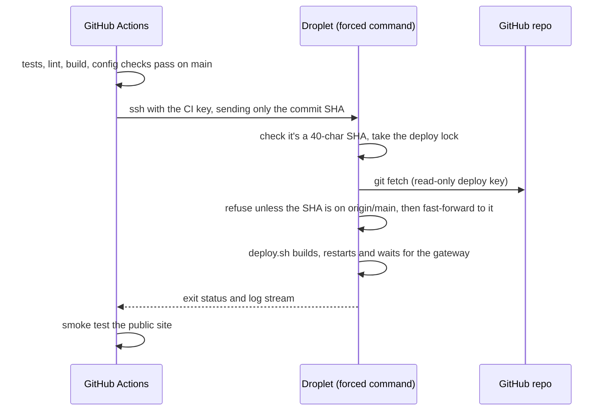

# Deploying to a DigitalOcean droplet

The app runs on a droplet shared with other KLOWORLD apps. Two repos are involved:

- **[`kloworld-edge`](https://github.com/ko222uky/kloworld-edge)** owns the host: it sets up
  Docker, swap and the firewall, and runs the **edge proxy** (Caddy) at `/opt/kloworld-edge`.
  That proxy is the only thing listening on ports 80/443. It obtains HTTPS certificates
  automatically and forwards each hostname to one app.
- **This repo** runs at `/opt/mlops-demo` as its own compose project. Its gateway publishes
  no public ports. It joins the shared `edge` Docker network as `datadrift-gateway`, and its
  loopback port `127.0.0.1:8001` is only for health checks.

```
Internet ─► :443 edge proxy (/opt/kloworld-edge) ─┬─► datadrift-gateway:80 (/opt/mlops-demo)
                                                   └─► <other apps>
```

## 1. Create the droplet

Skip this if the droplet already runs `kloworld-edge`.

| Setting | Recommendation |
|---|---|
| Image | Ubuntu 24.04 LTS x64 |
| Size | **Basic, 2 vCPU / 4 GB** (about $24/mo) recommended. 2 GB works for running the stack, but builds rely on the swap file that `kloworld-edge`'s `provision.sh` adds. Other apps share the same memory |
| Auth | SSH key |
| Extras | Enable monitoring; optionally add a Cloud Firewall allowing 22, 80, 443 (TCP + UDP 443) |

## 2. Point a hostname at it

HTTPS needs a hostname:

- **Your own domain:** use a subdomain such as `datadrift.example.com` and create an `A` record
  for it at whichever provider hosts the domain's DNS:

  | Type | Name | Value | TTL |
  |---|---|---|---|
  | `A` | `datadrift` | droplet IPv4 (or its Reserved IP) | 300 |

  - **Cloudflare:** set the record's proxy status to **DNS only** (grey cloud). If it's
    proxied, visitors reach Cloudflare instead of the droplet, and Caddy's Let's Encrypt
    certificate can fail. `nslookup` should return the droplet's IP, not a Cloudflare
    `104.x` or `172.64–71.x` address.
  - **Optional Reserved IP** (DigitalOcean → Networking → Reserved IPs): free while
    attached. Point DNS at it, and a rebuilt droplet can take over the same address.
  - Only the subdomain needs a record; the bare domain can stay empty.
  - Don't add an `AAAA` (IPv6) record until HTTPS works over IPv4. Let's Encrypt prefers
    IPv6, and a broken IPv6 path blocks certificate issuance.
- **No domain:** use `sslip.io`, which resolves `<ip-with-dashes>.sslip.io` to that IP. For
  example, `203-0-113-10.sslip.io` works with no DNS setup at all.

The name must resolve **before** the edge proxy starts serving it (step 5).

## 3. Provision the host and fetch the code

**The host** is set up once, for every app, by `kloworld-edge`. Its README covers it:
`scripts/provision.sh` (Docker, swap, firewall, unattended upgrades, and the `edge` network),
then `scripts/deploy.sh` to start the proxy. Skip this if the droplet already runs it.

### Private repository: give the droplet a read-only deploy key

A private repo can't be cloned anonymously. A **deploy key** is an SSH key that GitHub
accepts for **one repository, read-only**, so the droplet can clone and later `git pull`
without your personal credentials. The key pair is created **on the droplet**: the private
key never leaves it, and only the public half goes to GitHub.

1. **On the droplet,** create the key and pin GitHub's host key. The fingerprint check
   guards against connecting to an impostor server; compare it with the fingerprint in
   [GitHub's published SSH key fingerprints](https://docs.github.com/en/authentication/keeping-your-account-and-data-secure/githubs-ssh-key-fingerprints):

   ```bash
   ssh root@<droplet-ip>
   ssh-keygen -t ed25519 -N "" -C "deploy@<your-hostname>" -f ~/.ssh/github_deploy
   ssh-keyscan -t ed25519 github.com > /tmp/gh_key
   ssh-keygen -lf /tmp/gh_key   # must print SHA256:+DiY3wvvV6TuJJhbpZisF/zLDA0zPMSvHdkr4UvCOqU
   cat /tmp/gh_key >> ~/.ssh/known_hosts
   printf 'Host github.com
  User git
  IdentityFile ~/.ssh/github_deploy
  IdentitiesOnly yes
' >> ~/.ssh/config
   chmod 600 ~/.ssh/config
   cat ~/.ssh/github_deploy.pub   # the public key: copy this single line
   ```

2. **On GitHub,** open the repo → **Settings → Deploy keys → Add deploy key**. Paste the
   public key as one line, and leave **Allow write access unticked**.
3. **Check** that GitHub accepts it, then clone:

   ```bash
   ssh -T git@github.com   # "Hi <owner>/<repo>! You've successfully authenticated…"
   git clone git@github.com:<owner>/<repo>.git /opt/mlops-demo
   ```

GitHub accepts a deploy key for **one** repository only. A second private repo cloned on the
same droplet needs its own key and a `Host` alias in `~/.ssh/config`, as shown in the
`kloworld-edge` README.

To revoke access later, delete the key on GitHub. For a **public** repo, skip the deploy key
and run `git clone https://github.com/<owner>/<repo>.git /opt/mlops-demo`.

### Create `.env`

Now that the code is in place, run this repo's `provision.sh`. It checks that the host is
ready (Docker and the `edge` network), then creates `/opt/mlops-demo/.env` (mode 600) with
generated passwords and secrets and the droplet settings `HTTP_PORT=8001` and
`COMPOSE_FILE=docker-compose.yml:compose.edge.yml`:

```bash
bash /opt/mlops-demo/deploy/droplet/provision.sh
```

## 4. Configure

Edit `/opt/mlops-demo/.env`:

```bash
PUBLIC_HOST=demo.example.com
PUBLIC_ORIGIN=https://demo.example.com
COOKIE_SECURE=true
COMPOSE_FILE=docker-compose.yml:compose.edge.yml   # set by provision.sh
HTTP_PORT=8001                                      # set by provision.sh
```

Your operator password is the generated `ADMIN_PASSWORD` in the same file.

## 5. Deploy

```bash
bash /opt/mlops-demo/deploy/droplet/deploy.sh
```

This pulls the latest code, builds the images, starts the stack and waits until the gateway
answers on `127.0.0.1:8001`. The first build takes several minutes, mostly for PyTorch and
the Next.js build.

Then route the hostname to it: in `kloworld-edge`, add a site file such as
`caddy/sites/datadrift.caddy` (`demo.example.com { import common; reverse_proxy
datadrift-gateway:80 }`), merge it, and run `bash /opt/kloworld-edge/scripts/deploy.sh`.
The proxy obtains the certificate within seconds. Then:

- `https://demo.example.com/`: dashboard (public)
- `https://demo.example.com/login`: operator sign-in
- `https://demo.example.com/mlflow/`: MLflow UI (after sign-in)

## Automatic deploys (GitHub Actions)

Every push to `main`, including a merged pull request, runs CI. When all checks pass, the
`deploy` job in `.github/workflows/ci.yml` deploys **that exact commit** to the droplet and
smoke-tests the site. You can also redeploy `main` from **Actions → CI → Run workflow**.



**How the CI key is locked down.** CI uses its own SSH key, separate from your personal key
and from the GitHub deploy key. In `/root/.ssh/authorized_keys` it's bound to a *forced
command*:

```
restrict,command="/usr/local/bin/mlops-ci-deploy" ssh-ed25519 AAAA… github-actions-deploy@…
```

- `restrict` disables shells, terminals and port or agent forwarding.
- Whatever the client asks to run is passed to `mlops-ci-deploy` (source:
  `deploy/droplet/ci-deploy.sh`), which accepts only a commit SHA already on `origin/main`.
- A leaked key could therefore only redeploy code that's already merged.
- The script lives outside the repo, so a `git pull` can never change a script while it runs.

### Setting it up

1. **Create the CI key** on your machine: `ssh-keygen -t ed25519 -N "" -C github-actions-deploy -f ci_deploy_key`.
2. **Install the script and the key on the droplet:**

   ```bash
   scp deploy/droplet/ci-deploy.sh root@<droplet-ip>:/usr/local/bin/mlops-ci-deploy
   ssh root@<droplet-ip> 'chmod 755 /usr/local/bin/mlops-ci-deploy'
   ssh root@<droplet-ip> "echo 'restrict,command=\"/usr/local/bin/mlops-ci-deploy\" $(cat ci_deploy_key.pub)' >> ~/.ssh/authorized_keys"
   ```

3. **Add three repository secrets with the GitHub CLI** ([`gh`](https://cli.github.com/)).
   Set the private key **from the file, not by pasting**. A key pasted into the browser form
   is easily corrupted (a missed line, joined lines, Windows line endings), and the deploy
   then fails with `Load key …: error in libcrypto`. Piping the file uploads the exact bytes:

   ```bash
   gh auth login --hostname github.com --git-protocol ssh --web --skip-ssh-key   # once
   gh secret set DEPLOY_SSH_KEY     --repo <owner>/<repo> < ci_deploy_key
   gh secret set DEPLOY_HOST        --repo <owner>/<repo> --body "<droplet-ip>"
   ssh-keygen -F <droplet-ip> | grep ssh-ed25519 | gh secret set DEPLOY_KNOWN_HOSTS --repo <owner>/<repo>
   gh secret list --repo <owner>/<repo>
   ```

   | Secret | Value |
   |---|---|
   | `DEPLOY_HOST` | the droplet's IP |
   | `DEPLOY_SSH_KEY` | the whole *private* key file `ci_deploy_key` |
   | `DEPLOY_KNOWN_HOSTS` | the droplet's host key line from `ssh-keygen -F <droplet-ip>` (verify its fingerprint first), e.g. `203.0.113.10 ssh-ed25519 AAAA…` |

   On Windows, install the CLI with `winget install --id GitHub.cli`.

4. **Delete the local private key** once it's saved in GitHub.
5. **Check it:** re-run the latest CI run on `main` (**Actions → CI → Re-run all jobs**, or
   `gh run rerun <run-id> --repo <owner>/<repo>`). The **Configure SSH** step prints
   `Deploy key fingerprint: SHA256:…`, which must match `ssh-keygen -lf ci_deploy_key.pub`.

The job uses a GitHub **environment** named `production`, so every deploy appears under the
repo's *Deployments*. To require manual approval before each deploy, add yourself as a
required reviewer under **Settings → Environments → production**.

### Maintenance

- **Changed `ci-deploy.sh`?** Reinstall it with the `scp` / `chmod` lines above.
- **Revoke or rotate the CI key:** delete its line from `/root/.ssh/authorized_keys`. To
  rotate, repeat steps 1–4.
- **Serialised deploys:** they queue rather than overlap (a GitHub concurrency group plus a
  lock file on the droplet, which manual `deploy.sh` runs through `mlops-ci-deploy` also
  respect).
- **Each deploy restarts the model service,** which starts a new simulation session.

## Operations

| Task | Command (from `/opt/mlops-demo`) |
|---|---|
| Update to latest `main` | Automatic on merge (see above); manual fallback: `bash deploy/droplet/deploy.sh` |
| Status | `docker compose ps` |
| Logs | `docker compose logs -f --tail=100 model` (or `gateway`, `mlflow`, …) |
| Edge proxy logs (TLS, 502s) | `cd /opt/kloworld-edge && docker compose logs -f --tail=100 caddy` |
| Gateway, bypassing the edge | `curl http://127.0.0.1:8001/api/model/health` |
| Restart one service | `docker compose restart model` |
| Back up databases + artifacts | `bash deploy/droplet/backup.sh /var/backups/mlops-demo` |
| Stop everything | `docker compose down` (volumes, and therefore data, are kept) |

To schedule nightly backups, add this line with `crontab -e`:

```
0 3 * * * bash /opt/mlops-demo/deploy/droplet/backup.sh /var/backups/mlops-demo >> /var/log/mlops-backup.log 2>&1
```

Then copy `/var/backups/mlops-demo` off the droplet, for example to DigitalOcean Spaces.

### Restore

```bash
docker compose exec -T postgres pg_restore -U mlops -d mlflow --clean < backups/mlflow-<stamp>.dump
docker compose run --rm --no-deps -T --entrypoint tar mlflow -C /mlartifacts -xzf - < backups/mlartifacts-<stamp>.tar.gz
docker compose restart mlflow
```

## Troubleshooting

| Symptom | Check |
|---|---|
| `git clone` / `ssh -T git@github.com`: `Permission denied (publickey)` | GitHub doesn't know the key. Check the repo's Deploy keys list shows the same fingerprint as `ssh-keygen -lf ~/.ssh/github_deploy.pub`; re-paste it as one line if not. (A key added to the wrong repo or to your account authenticates instead.) |
| Actions `deploy` job: `Permission denied (publickey)` | GitHub's `DEPLOY_SSH_KEY` isn't the key in the droplet's `authorized_keys`. The **Configure SSH** step prints the loaded key's fingerprint: compare it with `ssh-keygen -lf` of the CI line in `/root/.ssh/authorized_keys`. Windows line endings are stripped automatically; if the fingerprints differ, rotate the key (see "Automatic deploys") |
| Actions `deploy` job: `DEPLOY_SSH_KEY is not a usable private key` | The secret is empty, misnamed or damaged (a partial paste, joined lines, or the public key by mistake); all of these give `error in libcrypto`. Set it from the file with `gh secret set DEPLOY_SSH_KEY < ci_deploy_key`. If the original private key is gone, rotate the key (see "Automatic deploys") |
| Actions `deploy` job: `Host key verification failed` | `DEPLOY_KNOWN_HOSTS` doesn't match the droplet (for example after a rebuild). Re-verify the fingerprint and update the secret |
| Actions `deploy` job: `is not on origin/main; refusing to deploy` | The run wasn't for a commit on `main`; only `main` deploys |
| Browser shows a certificate error | DNS must resolve to the droplet before the edge proxy serves the name. The ACME errors are in the edge proxy's logs (`cd /opt/kloworld-edge && docker compose logs caddy`) |
| `502 Bad Gateway` from the site | The edge proxy can't reach `datadrift-gateway:80`. Check `docker compose ps` here, and that `COMPOSE_FILE` in `.env` includes `compose.edge.yml` (`docker network inspect edge` should list `mlops-demo-gateway-1`) |
| `network edge declared as external, but could not be found` | The host isn't provisioned by `kloworld-edge`, or the network was removed. `docker network create edge`, then deploy again |
| Everyone gets "too many attempts" on login at once | The gateway isn't trusting the edge proxy's `X-Forwarded-For`, so every client shares one IP. Keep `trusted_proxies` in the Caddyfile's global block |
| Login succeeds, but controls still say "Sign in" | With HTTPS, `COOKIE_SECURE=true`. On plain HTTP it must be `false`, or the browser drops the cookie |
| MLflow shows `Invalid Host header` / blocked requests | `PUBLIC_HOST` / `PUBLIC_ORIGIN` must match the address in the browser |
| Build killed / exit 137 | Out of memory. Check `swapon --show`, or resize the droplet |
| `dependency failed to start: container … is unhealthy` | A service took longer to start than its health check allows, most often MLflow on first boot (migrations). Check `docker compose ps`; once it reports `healthy`, re-run `deploy.sh` (the build is cached, so it only starts what's missing) |
| Dashboard shows "Model service unreachable" | `docker compose logs model`; the model waits for postgres and mlflow to report healthy |

## Security notes

- Only the edge proxy listens publicly. This app's gateway publishes just `127.0.0.1:8001`.
  Postgres, MLflow and the Python services sit on the internal compose network, and only the
  gateway joins the shared `edge` network.
- Docker publishes ports by writing iptables rules that bypass `ufw`. Never publish an app
  port without the `127.0.0.1:` prefix. A DigitalOcean Cloud Firewall sits in front of the
  droplet and isn't affected by this.
- Rotate `JWT_SECRET` to sign out every session. Rotate `ADMIN_PASSWORD` by editing `.env`
  and running `docker compose up -d auth`.
